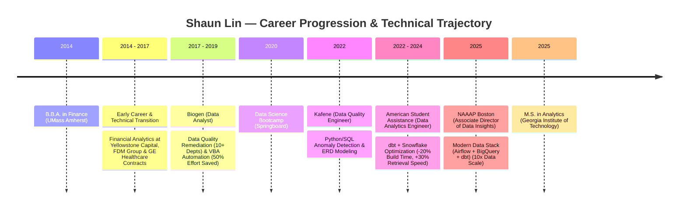

# Hi there, I'm Shaun Lin 👋

> **Data Analytics Engineer** | Georgia Tech MS in Analytics | Associate Director of Data Insights @ NAAAP Boston

---

### 🏛️ About Me

Analytical, business-driven Data Analytics Engineer with expertise in building scalable dbt data pipelines, optimizing Snowflake & BigQuery data warehouses, and modeling dimensional star schemas. Passionate about converting raw, messy data into high-leverage business insights and decision assets.

* 🎓 **Education**: Recently completed **Master of Science in Analytics** from **Georgia Tech**.
* 💼 **Leadership**: Associate Director of Data Insights at **NAAAP Boston**.
* ⚡ **Core Focus**: `dbt (Core/Cloud)`, `Snowflake`, `BigQuery`, `SQL Query Optimization (8m → <15s)`, `Python`, `Dimensional Modeling`.

---

### ⏳ Career Timeline & Impact Milestones

> 🌐 **Live Interactive Visualizer**: [shaundataanalytics.github.io](https://shaundataanalytics.github.io/) | 📄 **Full Screen Timeline**: [shaundataanalytics.github.io/timeline.html](https://shaundataanalytics.github.io/timeline.html)

| Period | Role | Organization | Key Impact & Technologies |
| :--- | :--- | :--- | :--- |
| **Jan 2025 – Present** | Associate Director of Data Insights | **NAAAP Boston** | Deployed 1st end-to-end modern data stack (`Airflow` + `BigQuery` + `dbt`), processing **10x data volume**. Established Kanban & code reviews. |
| **May 2025** | M.S. in Analytics | **Georgia Tech** | Advanced analytical modeling, statistical computing, and machine learning. |
| **Jun 2022 – Jun 2024** | Data Analytics Engineer | **American Student Assistance** | Optimized 10+ dbt models & Snowflake DBs (**-20% build time**, **+30% retrieval speed**). Unified 10+ data sources into Snowflake single source of truth. |
| **Feb 2022 – Apr 2022** | Data Quality Engineer | **Kafene** | Built Python & SQL anomaly detection scripts, expanding data quality test coverage. Created Data Dictionary & ERDs. |
| **Aug 2020** | Data Science Bootcamp | **Springboard** | Intensive Data Science, Python, pandas, and Machine Learning capstone projects. |
| **Dec 2017 – Dec 2019** | Data Analyst | **Biogen** | Remediated data quality across 10+ departments. Built Excel VBA automated migration solutions (**50% manual effort saved**). |
| **2014 – 2017** | Financial & Data Analyst / IT Consultant | **Yellowstone Capital • FDM Group • GE Healthcare Contracts** | Financial analytics & risk modeling post-graduation. Completed IT/BI training at FDM Group. Managed data reporting contracts across healthcare/tech. |
| **May 2014** | B.B.A. in Finance | **UMass Amherst** | Financial modeling, business economics, and quantitative analysis. |

---

### 🛠️ Technical Stack & Skills

| Category | Technologies & Tools |
| :--- | :--- |
| **Data Warehousing & Querying** | Snowflake, Google BigQuery, PostgreSQL, SQL (CTEs, Window Functions, Query Profiling) |
| **Analytics Engineering & Modeling** | dbt (Core & Cloud), MetricFlow, Kimball Star Schema Modeling (Fact & Dimension Tables) |
| **Languages & Automation** | Python (pandas, NumPy, PySpark), Bash/Zsh, Git, GitHub Actions, Docker |
| **BI & Analytics** | Tableau, Metabase, Looker, Data Pipeline Benchmarking |
| **AI & Knowledge Systems** | Google NotebookLM, Obsidian Vault OS, LLM Agentic Workflows |

---

### 🚀 Featured Repositories & Benchmarks

* 📚 **[collaborative-book-recommender-engine](https://github.com/ShaunDataAnalytics/collaborative-book-recommender-engine)**  
  *Hybrid recommendation engine analyzing 1.1M user ratings over 270,000+ books using Cosine Similarity & SVD.*
* 📊 **[data-science-portfolio-labs](https://github.com/ShaunDataAnalytics/data-science-portfolio-labs)**  
  *Customer segmentation and 3D clustering analysis dashboard using K-Means and PCA dimensionality reduction.*
* 🏠 **[real-estate-valuation-ml](https://github.com/ShaunDataAnalytics/real-estate-valuation-ml)**  
  *Predictive property pricing pipeline utilizing XGBoost & LightGBM regressors with 35+ engineered features ($R^2 = 0.912$).*
* 🤖 **[focus-pomodoro-chrome-extension](https://github.com/ShaunDataAnalytics/focus-pomodoro-chrome-extension)**  
  *Micro-sprint productivity browser extension for deep work focus.*

---

### 📬 Connect & Collaborate

- 💼 **LinkedIn**: [linkedin.com/in/shaundataanalytics](https://www.linkedin.com/in/shaundataanalytics/)
- 🌐 **Portfolio & Interactive Timeline**: [shaundataanalytics.github.io](https://shaundataanalytics.github.io)
- 📍 **Location**: Malden, MA (Open to Remote / Florida hybrid opportunities)
